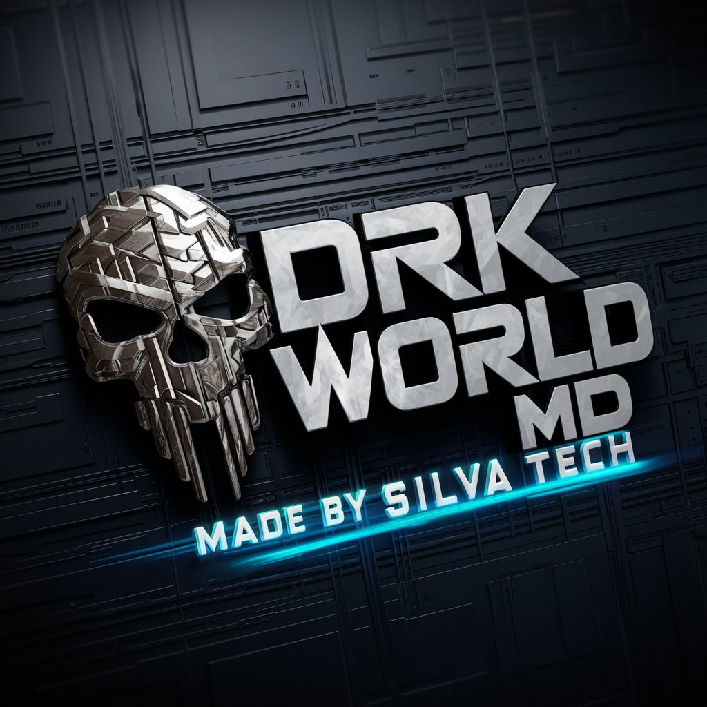

 

<h1 align="center">Darkworld Md<br></h1>
<p align="center">

</p>

<p align="center">
Darkworld Bot Multi Device is a whatsapp bot created by <a href="https://github.com/SilvaTechB" target="_blank">silva</a> using <a href="https://github.com/adiwajshing/Baileys" target="_blank">Baileys</a> and <a href="https://github.com/nodejs" target="_blank">Nodejs</a>. Dont forget to give a star bro.
</p>

<p align="center">
<a href="https://youtube.com/silvaedits254"></a>
</p>

------

# ```Bot Info```
<p align="center">
<a href="https://github.com/SilvaTechB/followers"></a>
<a href="https://github.com/SilvaTechB/Darkworld-Md/stargazers/"></a>
<a href="https://github.com/SilvaTechB/Darkworld-Md/network/members"></a>
<a href="https://github.com/SilvaTechB/Darkworld-Md/watchers"></a>
<a href="https://github.com/SilvaTechB/Darkworld-Md"></a>
<a href="https://github.com/SilvaTechB/Darkworld-Md/"></a>
<a href="https://hits.seeyoufarm.com"></a>
<a href="https://github.com/DGXeon/CheemsBot-MD11/graphs/commit-activity"></a>&nbsp;&nbsp;
</p>
<p align='center'>
    </p>

-------

## ```Connect With Me```
<p align="center">
<a href="https://youtube.com/@silvaedits254"><br>
<a href="https://www.whatsapp.com/channel/0029VaAkETLLY6d8qhLmZt2v"><br>
<a href="https://t.me/silvatech">
<a href="https://chat.whatsapp.com/BW0o3ZyiAF5Azb1bIqG9Ue">
<a href="https://www.instagram.com/unicorn_xeon13?igsh=MzNlNGNkZWQ4Mg==">
</p>


## ```Bot Support Group Chats```

## `For Termux & Panel User, Download This👇`
- [`Click Here`](https://shrinkme.pro/y07LYARu)


# Setup For Deployment 👇

- FORK THE REPOSITORY [Here](https://github.com/SilvaTechB/Darkworld-Md/fork)

## `Generate Pair Code For Session`
[](https://replit.com/@DGXeon/Xeon-PairCode)
1. a session will be sent on your whatsapp
2. on your repo open a folder called session
3. upload your cred.json in the folder
4. save changes and deploy darkworld md in any of your trusted plaltform
5. dont use koyeb

## ` BUILDPACKS`

```
https://github.com/jonathanong/heroku-buildpack-ffmpeg-latest
https://github.com/clhuang/heroku-buildpack-webp-binaries.git
```

[](https://heroku.com/deploy?template=https://github.com/SilvaTechB/Darkworld-Md/)

# Install Manually 👇
## `Requirements`
* [Node.js](https://nodejs.org/en/)
* [Git](https://git-scm.com/downloads)
* [FFmpeg](https://github.com/BtbN/FFmpeg-Builds/releases/download/autobuild-2020-12-08-13-03/ffmpeg-n4.3.1-26-gca55240b8c-win64-gpl-4.3.zip)
* [Libwebp](https://developers.google.com/speed/webp/download)
* Any text editor
## `Clone Repo & Installation dependencies`
```bash
git clone https://github.com/SilvaTechB/Darkworld-Md.git
cd DarkWorld-Md

npm start
```
## `For Termux/Ssh/Ubuntu`
```bash
apt update
apt upgrade
pkg update && pkg upgrade
pkg install bash
pkg install libwebp
pkg install git -y
pkg install nodejs -y 
pkg install ffmpeg -y 
pkg install wget
pkg install imagemagick -y
git clone https://github.com/SilvaTechB/Darkworld-Md
cd Darkworld-Md
yarn install
npm start
```
## `For VPS`
```bash
apt install nodejs 
apt install git 
apt apt install ffmpeg 
apt apt install libwebp 
apt apt install imagrmagick
apt install bash
git clone https://github.com/SilvaTechB/Darkworld-Md
cd Darkworld-Md
npm start
```
## `For 24/7 Activation (Termux)`
```bash
npm i -g pm2 && pm2 start index.js && pm2 save && pm2 logs
```
